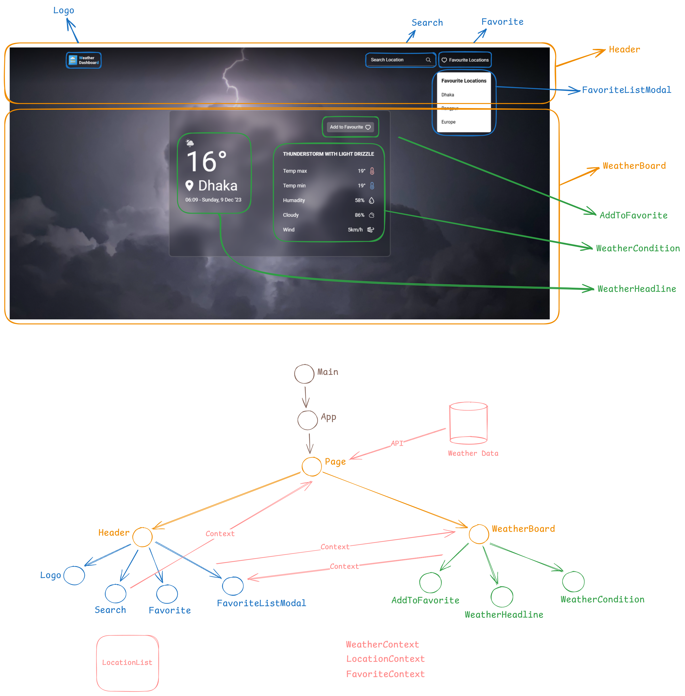

# Weather Dashboard Component Structure

Below is the component structure for the Weather Dashboard application. The structure was designed using Excalidraw to provide a high-level overview of the application's components and their relationships.

## Component Structure Diagram

## Key Components

- **App**: The main container component
- **Header**: Navigation elements (logo, search, favorite locations)
- **Page**: Main page layout
- **WeatherBoard**: Contains weather information
- **WeatherHeadline**: Displays main weather details (temperature, location, time)
- **WeatherCondition**: Displays additional weather details (humidity, wind, cloud percentage)
- **AddToFavorite**: Button to add/remove locations from favorites
- **FavoriteListModal**: Modal to display favorite locations
- **Favorite**: Button to show favorite locations modal
- **Search**: Search bar for location search

## Component Relationships

- **App** contains **LocationProvider**, **WeatherProvider**, and **FavoriteProvider**
- **Page** contains **Header** and **WeatherBoard**
- **WeatherBoard** renders **WeatherHeadline**, **WeatherCondition**, and **AddToFavorite**
- **Header** contains **Logo**, **Search**, and **Favorite**
- Clicking **Favorite** displays the **FavoriteListModal**
- **Search** uses useDebounce to handle search input
- **AddToFavorite** manages favorite locations using useLocalStorage
- **WeatherProvider** fetches and provides weather data using useWeather
- **LocationProvider** manages selected location state
- **FavoriteListModal** displays a list of favorite locations
- **Favorite** button toggles the visibility of **FavoriteListModal**
- **WeatherHeadline** displays the main weather details for the selected location
- **WeatherCondition** shows additional weather details like humidity, wind speed, and cloud percentage
- **AddToFavorite** button allows users to add or remove the current location from their favorites list
- **useWeather** hook fetches weather data from an external API
- **useLocalStorage** hook manages the persistence of favorite locations in local storage
- **useDebounce** hook optimizes the search input to reduce the number of API calls

## Notes

- This structure is a simplified representation and may not encompass all aspects of a production weather dashboard application
- Implementation details may vary based on the chosen technology stack
